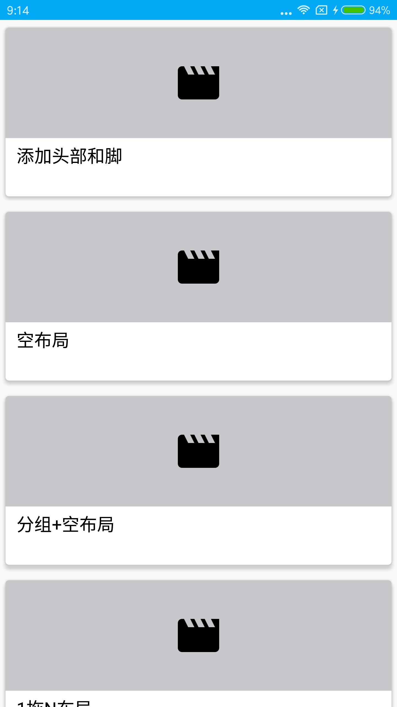
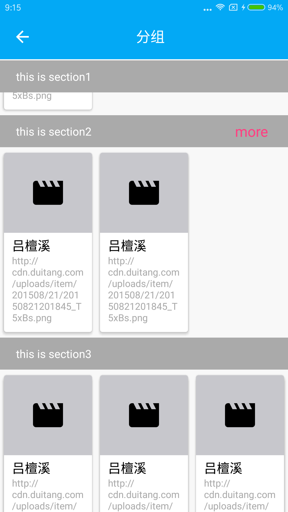
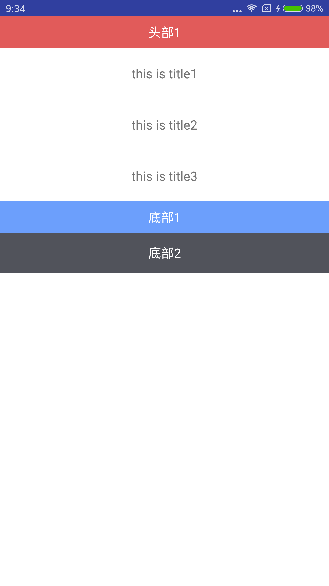

#### 目录
[](https://jitpack.io/#lvtanxi/BaseVLayoutAdapterHelper)

# BaseVLayoutAdapterHelper
是基于阿里V-Layout的一个Android 简单的封装的通用Adapter。

## 引入

```
allprojects {
    repositories {
        maven { url 'https://jitpack.io' }
    }
}
```
```
 implementation 'com.github.lvtanxi:BaseVLayoutAdapterHelper:lasetversion'
```

## 使用

##（1）简单的数据绑定
```
        VBaseAdapter<NormalModel>  mBaseAdapter= new VBaseAdapter<NormalModel>(R.layout.item_main) {
            @Override
            protected void convert(VBaseHolderHelper helper, NormalModel model, int position) {
                helper.setText(R.id.main_test, model.getTitle());
            }
        };
        VirtualLayoutManager layoutManager = new VirtualLayoutManager(this);
        mRecycler.setLayoutManager(layoutManager);
        //总adapter
        DelegateAdapter delegateAdapter = new DelegateAdapter(layoutManager, true);
        delegateAdapter.addAdapter(mBaseAdapter.getTargetAdapter());
        mRecycler.setAdapter(delegateAdapter);
        
```
在convert方法中完成数据,只需要简单的将Adapter继承VBaseAdapter，复写convert方法即可。省去了自己编写ViewHolder等大量的重复的代码。
如果想自定义ViewHolder。就请ViewHolder继承VBaseHolder，然后完成相应的方法复写。


##（2）多种ItemView
```
        //设置LayoutManager
        VirtualLayoutManager layoutManager = new VirtualLayoutManager(this);
        mRecycler.setLayoutManager(layoutManager);
        mRecycler.addItemDecoration(new SectionDecoration(R.layout.multilt_text_view));

        //总adapter
        DelegateAdapter delegateAdapter = new DelegateAdapter(layoutManager, true);

        //各个adapter
        bannerAdapter = new VBaseAdapter<BannerBean>(R.layout.recyc_banner) {
            @Override
            protected void convert(VBaseHolderHelper holder, BannerBean bannerBean, int position) {
                Banner banner = holder.getView(R.id.banner);
                banner.setImages(bannerBean.getPic_url());
                //设置图片加载器
                banner.setImageLoader(new ImageLoader() {
                    @Override
                    public void displayImage(Context context, Object o, ImageView imageView) {
                        Glide.with(context).load((String) o).centerCrop().diskCacheStrategy(DiskCacheStrategy.ALL).into
                                (imageView);
                    }
                });
                banner.start();
            }
        };
        gridAdapter = new VBaseAdapter<GridBean>(R.layout.recyc_grid, getGridLayoutHelp()) {
            @Override
            protected void convert(VBaseHolderHelper holder, GridBean gridBean, int position) {
                Glide.with(TaobaoActivity.this).load(gridBean.getPic_url()).centerCrop().diskCacheStrategy(DiskCacheStrategy.ALL).into(holder.getImageView(R.id.icon));
                holder.setText(R.id.func, gridBean.getFunction());
            }
        };
        delegateAdapter.addAdapter(bannerAdapter);
        delegateAdapter.addAdapter(gridAdapter);
         mRecycler.setAdapter(delegateAdapter);
```
V-Layout 中自带了一个DelegateAdapter，可以添加很多个不同的Adapter,我们只需要按照顺序添加不同的Adapter就可以了


##（3）分组itemView
```
       mSectionedAdapter = new VBaseSectionedAdapter<Section2Model>(R.layout.multilt_text_view, R.layout.section_view)
       .....
      
```
VBaseSectionedAdapter 主要是针对分组的情况来做出的处理,json的格式如: [data1:[{},{}],data2:[{},{}]]，需要重写convert和convertChildItem方法


##（4）添加HeaderView、FooterView
```
     TextView header1Tv = new TextView(this);
     mBaseAdapter.addHeaderView(header1Tv);
     TextView footer1Tv = new TextView(this);
     TextView footer2Tv = new TextView(this);
     mBaseAdapter.addFooterView(footer1Tv);
     mBaseAdapter.addFooterView(footer2Tv);
     
     DelegateAdapter delegateAdapter = new DelegateAdapter(layoutManager, true);
     delegateAdapter.addAdapter(mBaseAdapter.getTargetAdapter());
     mRecycler.setAdapter(delegateAdapter);
     
```

这里比较纠结，因为V-Layout 已经实现了多Adapter模式，添加HeaderView、FooterView是否需要还有点考虑。类似装饰者模式，直接将原本的adapter传入，初始化一个HeaderAndFooterWrapper对象，然后调用相关API添加。
这里需要注意**delegateAdapter.addAdapter(mBaseAdapter.getTargetAdapter())**，使用了VHeaderFooterWrapper包装类(BaseAdapter中自动选择)




## 一些回调
```
        mBaseAdapter.addOnItemClickListener(new OnItemClickListener<String>() {
            @Override
            public void onItemClick(View view, int i, String s) {
                showToast(s);
            }
        });
        mBaseAdapter.addOnItemChildClickListener(new OnItemChildClickListener() {
            @Override
            public void onItemChildClick(View view, int i) {
                showToast("this is item : " + i+" say ,I'm a image ");
            }
        });

```


## 感谢

* [https://github.com/hongyangAndroid/baseAdapter](https://github.com/hongyangAndroid/baseAdapter)

   本文中用到的包装类灵感来源于鸿洋大神
   
* [https://github.com/alibaba/vlayout](https://github.com/alibaba/vlayout)
   	
   vlayout的项目地址

* [https://juejin.im/post/5a0107816fb9a0452b48a205](https://juejin.im/post/5a0107816fb9a0452b48a205)
	
	本文中很好的为V-Layout做了说明

## 尾声
这是自己第一次开源lib,很多地方经验不足，也希望大家会喜欢
